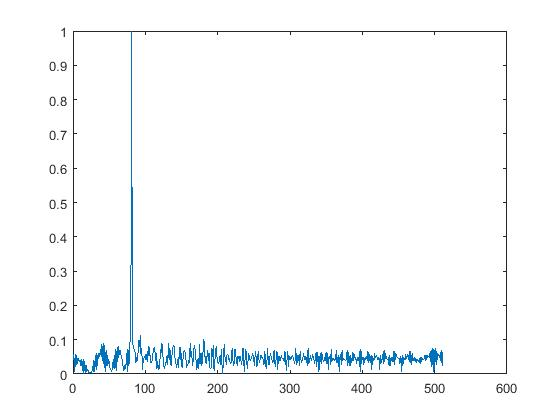
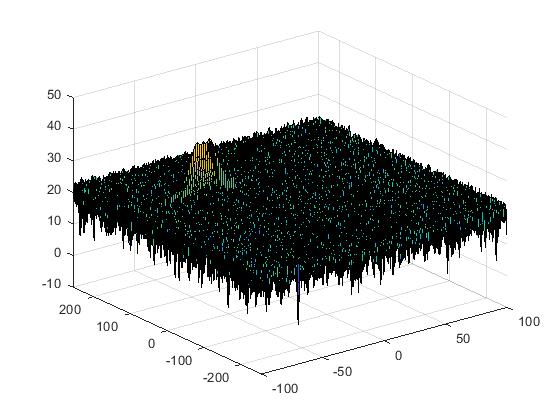
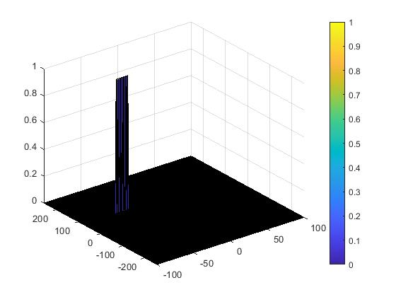

# SFND_Radar-Project
## Implemtation steps for 2D CFAR
1. Determine the number of Training cells for each dimension Tr and Td and the number of guard cells Gr and Gd.
2. Measure and average the noise across all the training cells.
3. Provide Offset and calculate threshold by adding offset to the noise.
4. Determine the signal level at the Cell Under Test. If the CUT signal level is greater than the threshold, assign a value as 1, else assign value as 0.
5. For all the remaining cells which are not CUT, assign the value as 0.
## Selection of Training, Guard cells and offset
 '''ruby Tr = 8, Td = 4, Gr = 4, Gd = 2, offset = 0.6. '''
## Steps taken to suppress the non-thresholded cells at the edges
'''ruby RDM(RDM~=0 & RDM~=1) = 0 '''
## Below are the images added
1. Range map plot is shown below.

2. Range doppler map plot is shown below.

3. 2D CFAR plot is shown below.

